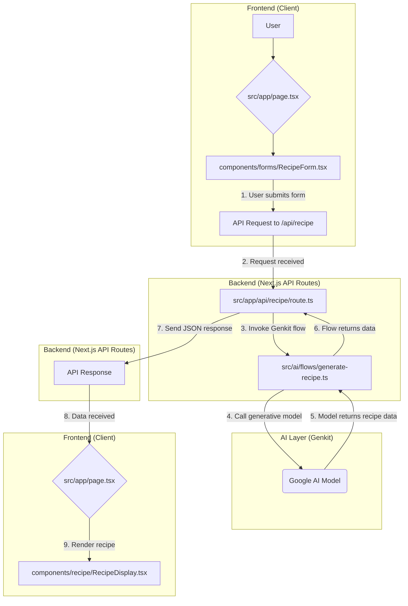

# Application Flow Diagram

This document outlines the high-level architecture and data flow of the StagKitchen application. It follows a typical **React Server Component (RSC)** pattern where the client-side components send requests to server-side API routes, which in turn execute the core AI logic using Genkit.

## Recipe Generation Flow

### Explanation of the Flow:

1.  **User Interaction (Frontend)**: The user visits the main page (`page.tsx`) and interacts with a form component like `RecipeForm.tsx` to input their desired ingredients, dietary restrictions, etc.
2.  **API Request (Frontend -> Backend)**: Upon submission, the form triggers an API call to the corresponding Next.js API route, for example, `/api/recipe`.
3.  **API Route Handling (Backend)**: The API route (`/src/app/api/recipe/route.ts`) receives the request. Its primary job is to act as a bridge to the AI logic.
4.  **AI Flow Invocation (Backend -> AI Layer)**: The API route imports and runs the relevant Genkit flow, in this case, `generateRecipe` from `/src/ai/flows/generate-recipe.ts`, passing along the user's input.
5.  **Generative AI Call (AI Layer)**: The Genkit flow contains the core logic. It defines the prompt and calls a generative model (like Google's Gemini) to generate the actual recipe content.
6.  **Data Return (AI Layer -> Backend -> Frontend)**: The generated recipe is returned from the model to the Genkit flow, then to the API route, which finally sends it back to the client as a JSON response.
7.  **Displaying the Result (Frontend)**: The frontend page receives the JSON data and uses a display component like `RecipeDisplay.tsx` to format and present the generated recipe to the user.

The same essential flow applies to the other features like generating a daily meal plan or summarizing a recipe, just with different forms, API routes, and AI flows.
